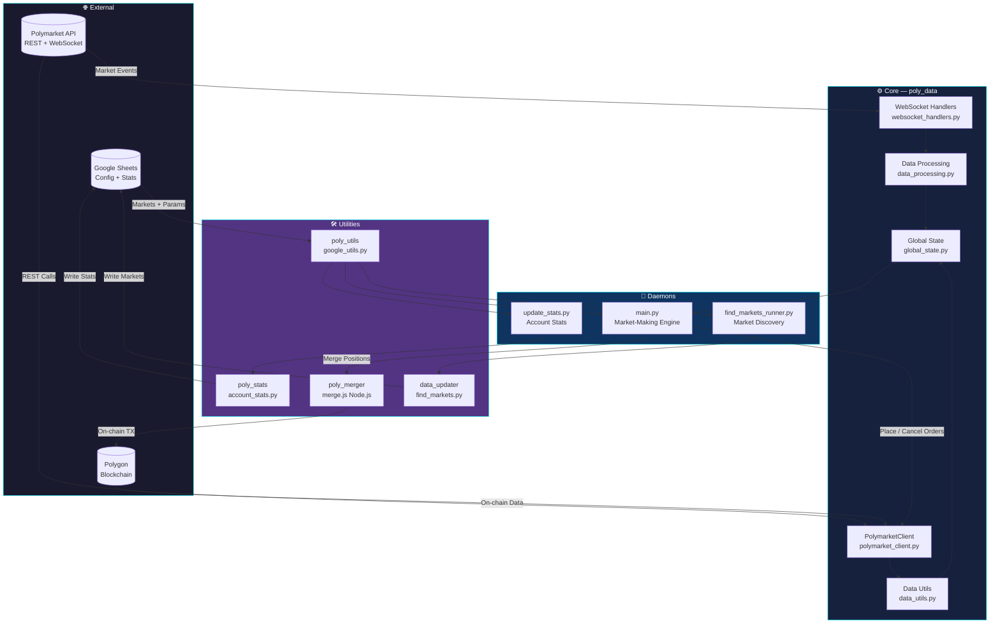
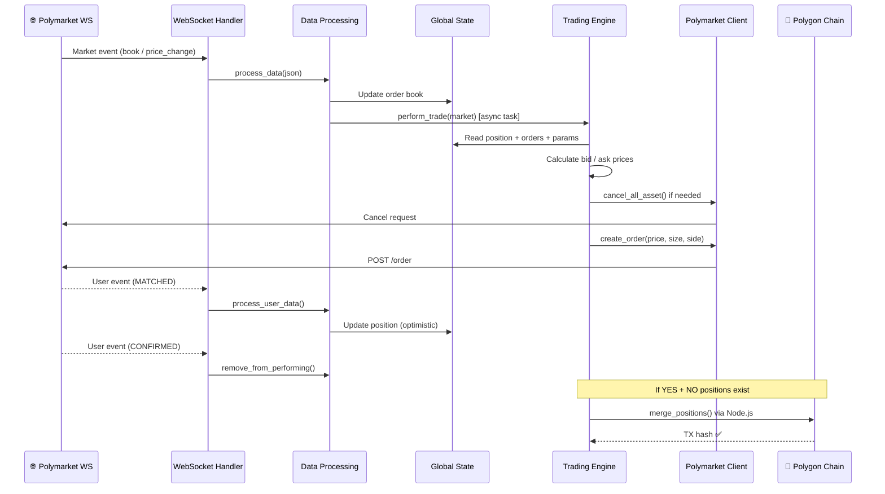
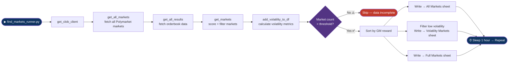

<div align="center">

<!-- Animated Wave Header -->


<!-- Typing Animation -->


<br/>

<!-- Tech Stack Badges -->
<p>
  
  
  
  
</p>
<p>
  
  
  
  
</p>

<!-- Social Links -->
<p>
  <a href="https://buymeacoffee.com/onlineunknowns">
    
  </a>
  <a href="https://wa.me/201286016083">
    
  </a>
  <a href="https://www.linkedin.com/in/onlineunknown/">
    
  </a>
</p>

</div>

---

> [!WARNING]
> **In today's market, this bot is not profitable and will lose money.** Use it as a reference implementation for building your own strategies, not as a ready-to-deploy solution. Given the increased competition on Polymarket, don't engage unless you're willing to dedicate significant time and capital.

---

## 📖 Overview

**Polymarket Monitoring System** is a fully automated market-making and monitoring bot for [Polymarket](https://polymarket.com) prediction markets. It provides liquidity on both sides of the order book with configurable risk parameters, real-time WebSocket feeds, and Google Sheets-based configuration.

---

## ✨ Features

<table>
<tr>
<td>

**🔄 Real-time Data**
- Live order book via WebSocket
- Automatic reconnection & fault tolerance
- Market + user event streams

</td>
<td>

**📊 Position Management**
- Automated position merging
- Risk controls & spread management
- Stale trade detection & cleanup

</td>
</tr>
<tr>
<td>

**⚙️ Flexible Configuration**
- Google Sheets-driven parameters
- Per-market hyperparameter tuning
- Environment variable overrides

</td>
<td>

**🔍 Market Discovery**
- Full Polymarket market scanner
- Volatility & reward scoring
- Auto-sync to Google Sheets

</td>
</tr>
</table>

---

## 🏗️ System Architecture

> How all modules connect together



---

## 🔄 Trading Lifecycle

> What happens from market event to order placement



---

## 🔍 Market Discovery Pipeline

> How new markets are found and synced to Google Sheets



---

## 🛠️ Tech Stack

<div align="center">

| Layer | Technology |
|---|---|
| **Language** |   |
| **Async Runtime** |  |
| **Blockchain** |   |
| **Data** |  |
| **Config** |  |
| **Package Manager** |   |

</div>

---

## 🚀 Installation

### Prerequisites

- Python **3.9.10+**
- Node.js **16+**
- Google Sheets API credentials
- Polymarket account with at least one trade via the UI

### 1 — Install UV

```bash
# macOS / Linux
curl -LsSf https://astral.sh/uv/install.sh | sh

# Windows
powershell -c "irm https://astral.sh/uv/install.ps1 | iex"
```

### 2 — Clone & install dependencies

```bash
git clone https://github.com/yourusername/polymarket-monitoring-system.git
cd polymarket-monitoring-system

# Python dependencies
uv sync

# Node.js dependencies (position merger)
cd poly_merger && npm install && cd ..
```

### 3 — Environment setup

```bash
cp .env.example .env
```

Edit `.env`:

```env
PK=your_polygon_private_key
BROWSER_ADDRESS=your_wallet_address
SPREADSHEET_URL=your_google_sheet_url
BROWSER_WALLET=your_browser_wallet_address
```

> ⚠️ Your wallet must have completed **at least one trade via the Polymarket UI** before the API permissions work correctly.

### 4 — Google Sheets setup

1. Create a **Google Service Account** and download `credentials.json` to the project root
2. Copy the [sample Google Sheet](https://docs.google.com/spreadsheets/d/1Kt6yGY7CZpB75cLJJAdWo7LSp9Oz7pjqfuVWwgtn7Ns/edit?gid=1884499063#gid=1884499063)
3. Share the sheet with your service account (Editor permission)
4. Set `SPREADSHEET_URL` in `.env`

---

## ▶️ Usage

```bash
# Start the market-making daemon
uv run python main.py

# Run the market discovery daemon (separate process / IP recommended)
uv run python find_markets_runner.py

# One-shot account stats update
uv run python update_stats.py
```

### Google Sheets configuration

| Sheet | Purpose |
|---|---|
| **Selected Markets** | Markets you want to trade |
| **All Markets** | Full Polymarket database (auto-updated) |
| **Volatility Markets** | Filtered low-volatility opportunities |
| **Hyperparameters** | Per-market trading parameters |

---

## ⚙️ Environment Variables

| Variable | Default | Description |
|---|---|---|
| `POSITION_REFRESH_SEC` | `5` | Position sync interval (seconds) |
| `MARKET_REFRESH_CYCLES` | `6` | Market metadata refresh (× position interval) |
| `STALE_TRADE_TTL_SEC` | `15.0` | Stale trade timeout (seconds) |
| `WS_RECONNECT_DELAY` | `1.0` | WebSocket reconnect delay (seconds) |
| `SHUTDOWN_TIMEOUT_SEC` | `10.0` | Graceful shutdown timeout |
| `LOG_LEVEL` | `INFO` | Logging level |
| `LOG_FILE` | `pms.log` | Log file path |

---

## 🤝 Support & Contact

<div align="center">

If this project helped you, consider buying me a coffee ☕

<a href="https://buymeacoffee.com/onlineunknowns">
  
</a>

<br/><br/>

<a href="https://wa.me/201286016083">
  
</a>
&nbsp;
<a href="https://www.linkedin.com/in/onlineunknown/">
  
</a>

</div>

---

## 📄 License

MIT — see [LICENSE](LICENSE) for details.

<div align="center">

</div>
